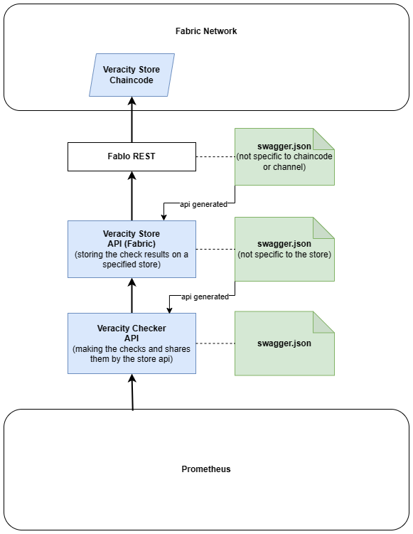

# Dataspace quality assurance

This project is meant to check the veracity of the data sent by the participants in the dataspace.

## Architecture

### Questions to answer:
- where should the CONFIG for the checks come from?
    - maybe should be a part of the CONTRACT?  - yes
    - then the checker api should be able to read the contract! - not necessarily the connector can get it and call the checker with it
- a contract can be used for multible data transfer?
- can CONRATCT ID be used to identify the data transfer and the checks?
- is QUERY important? leveldb cannot be queried - yes, i will try other db

## Connector and data transfer 

