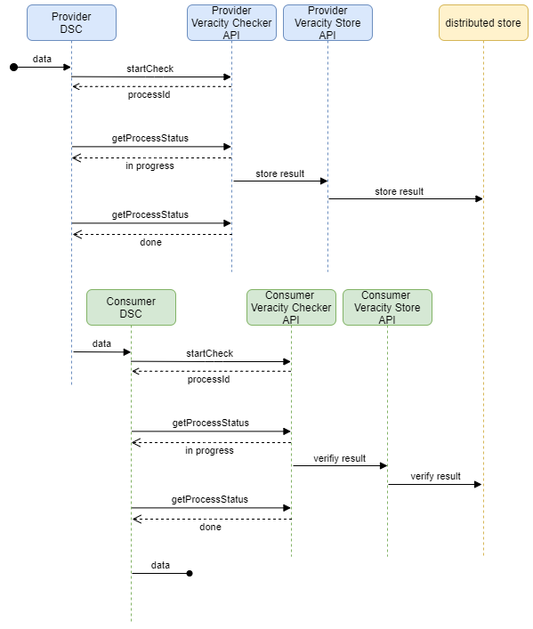

# Dataspace quality assurance

This project is meant to check the veracity of the data sent by the participants in the dataspace.

## Architecture

The architecture is composed of the following components:

- Prometheus-X: 
    - Dataspace Connector
    - ? Contract Manager (if de config will be called by the checker and not by the connector)
- **Veracity Checker API**
- **Veracity Store API**
- Fablo REST
- Fabric Network:
    - **Veracity Store Chaincode**

### Statements
- the check is done by the Veracity Checker API and not by a blockchain node, because:
    - the data sould not leave the tranfer network
    - the check should be done by a trusted party (the Veracity Checker API of the provider or the consumer)
    - the check cloud be a complex process that should not be done by the blockchain node
- the CONFIG for the checks should be a part of the CONTRACT
- the distributed store should be queryable

### Questions:
- check done by the connector or by the checker?
- who and what sould be able to see of the results of the check?

## Connector and data transfer 

