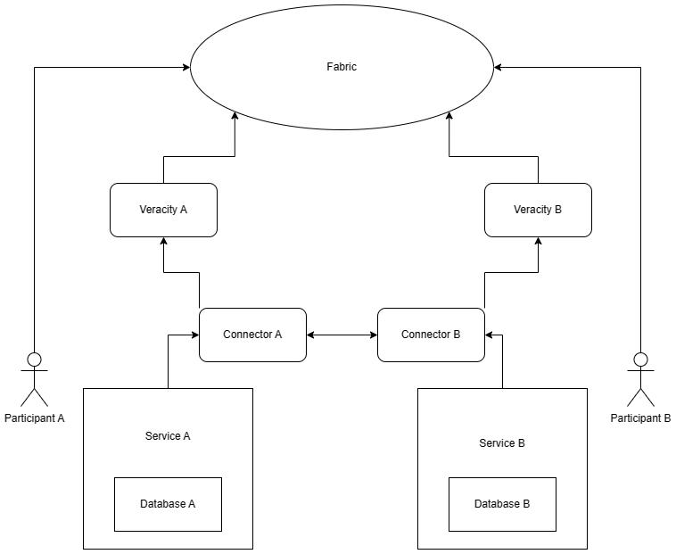

# data-veracity

This component is meant to be checking the veracity of the data sent by the participants in the dataspace.

I think that it should be runned by the participants themselves, and not by the a central authority. This is because in the consumer-provider flow the data should not be sent to any third party service. 

The checks results should be stored in a blockchain, but in a private channel between the consumer and the provider so that the participants can prove that they have been checking the same veracity of the data, and the other participant can see that the check has been done.



The check's themself could also run in fabric, but I dont know if the performance would be good enough for large datasets.

For processing, data and a config has to be sent, like this:

```json
{
  "data": [ {}, {}, {} ],
  "config": {}
}
```

The checks could be a long process, so the status can be checked. My question is that this status should be stored already in the blockchain, or it can be in the memory of the component, and only stored in the blockchain when the check is finished?
